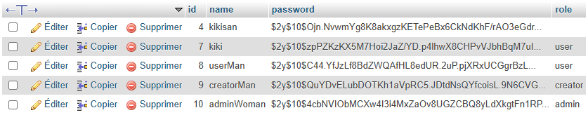
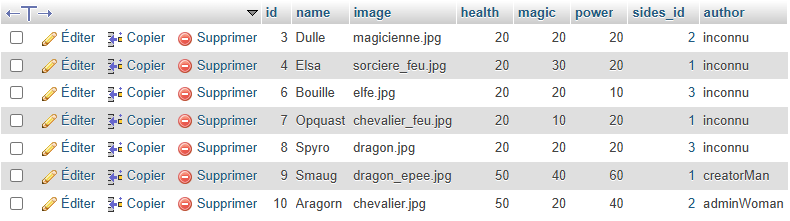
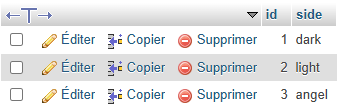

<<<<<<< HEAD
# Création de deck de combattants univers héroïque fantasy - PHP MVC POO

Ce projet est une application web de création de deck (combinaison de cartes) inspiré des univers héroïque fantasy développée en PHP, en respectant une architecture MVC moderne et une logique orientée objet.

## 🚀 Stack utilisée

- **PHP 8+**
- **Architecture MVC**
- **Programmation Orientée Objet (POO)**
- **PDO** (connexion sécurisée à la base de données)
- **MySQL / PhpMyAdmin**
- **HTML / CSS / JavaScript**
=======
# Projet PHP MVC POO

## 🚀 Stack utilisée

- **PHP**
- **Architecture MVC**
- **Programmation Orientée Objet (POO)**
- **PhpMyAdmin** (gestion de la base de données)
>>>>>>> 3ae65a2c1cecbfe592c74da7449df18d2154caeb

---

## 🧭 Fonctionnalités principales

### 🔐 Gestion utilisateur
- Inscription  
- Connexion  
- Déconnexion  
- Suppression de compte  

### 🛡️ Gestion des rôles et permissions
- **User**
  - Peut consulter la liste des personnages  
- **Creator**
  - Peut créer des personnages  
  - Peut modifier et supprimer **uniquement ses propres créations**  
- **Admin**
  - Accès complet : création, modification et suppression de tous les personnages  

---

## 👤 Comptes de démonstration

Pour tester les différents rôles :

### 🔸 Admin
- Identifiant : `adminWoman`  
- Mot de passe : `123`

### 🔸 Creator
- Identifiant : `creatorMan`  
- Mot de passe : `123`

### 🔸 User
- Identifiant : `userMan`  
- Mot de passe : `123`

<<<<<<< HEAD

=======
>>>>>>> 3ae65a2c1cecbfe592c74da7449df18d2154caeb
> ⚠️ Tous les mots de passe sont hashés en base de données.  
> Ces comptes sont uniquement destinés à la démonstration.

---

## 📌 Étapes possibles dans l'application

- S’enregistrer  
- Se connecter  
- Se déconnecter  
- Supprimer son compte  
- Consulter la liste des personnages crés (accéssible par tous : User, Creator, Admin)  
- Créer un personnage (Uniquement : Creator, Admin)  
- Modifier ou supprimer **ses propres** personnages (Creator)  
- Modifier ou supprimer **tous** les personnages (Admin)

---

## 🔧 Axes d'amélioration

- Renforcer la sécurisation des mots de passe  
- Rendre les noms d’utilisateurs sensibles à la casse  
- Ajouter des flash messages (succès / erreur)  
- Permettre de visiter le profil d’un autre utilisateur et voir sa collection  
- Ajouter une section commentaires  
- Ajouter une barre de recherche (personnage, classe, joueur…)
- Pourvoir télécharger et ajouter ses propres images/photos
<<<<<<< HEAD
- Amélioration visuel
=======
- Amélioration visuel

>>>>>>> 3ae65a2c1cecbfe592c74da7449df18d2154caeb
